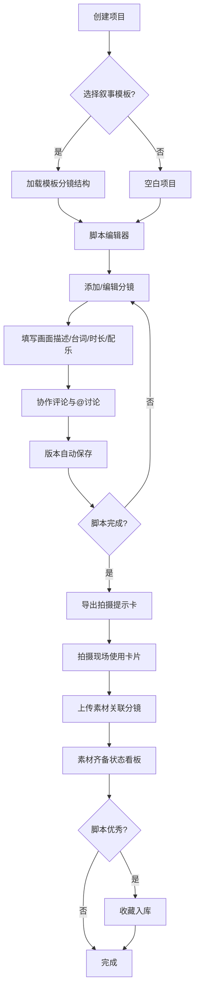

## 1. 产品概述

短视频脚本创作与团队协作工具——面向短视频创作团队的一站式脚本编写、分镜管理、多人协作与素材关联平台。解决传统脚本创作中协作混乱、版本追踪困难、素材与脚本脱节的问题，目标用户为MCN机构、短视频工作室、自媒体团队。

## 2. 核心功能

### 2.1 用户角色

| 角色 | 加入方式 | 核心权限 |
|------|----------|----------|
| 编导 | 创建/加入项目 | 创建项目、编辑全部分镜、导出拍摄卡、管理模板 |
| 文案 | 加入项目 | 编辑台词与画面描述、@成员讨论 |
| 拍摄 | 加入项目 | 上传素材、关联分镜、填写拍摄意见 |
| 剪辑 | 加入项目 | 查看素材齐备状态、编辑配乐建议 |

### 2.2 功能模块

1. **项目仪表盘**：项目列表、新建项目、叙事模板选择、脚本收藏库入口
2. **脚本编辑器**：分镜卡片排列、分镜详情编辑、时间轴节奏预览
3. **协作与讨论**：分镜评论、@提及、角色标注、实时状态指示
4. **版本历史**：修改记录时间轴、版本对比、一键回滚
5. **拍摄提示卡导出**：竖版卡片生成、分镜对应、现场翻阅优化
6. **素材管理**：素材上传、分镜关联、齐备状态看板
7. **脚本收藏库**：爆款脚本归档、分类浏览、一键复制为新项目
8. **叙事模板**：钩子开头、反转结尾等预设结构、自定义模板

### 2.3 页面详情

| 页面名称 | 模块名称 | 功能描述 |
|----------|----------|----------|
| 项目仪表盘 | 项目列表 | 展示所有参与项目卡片，含封面、标题、角色、最后编辑时间 |
| 项目仪表盘 | 新建项目 | 填写项目名称、类型、选择叙事模板，创建后进入编辑器 |
| 项目仪表盘 | 收藏库入口 | 按内容类型归档的爆款脚本列表，支持搜索与筛选 |
| 项目仪表盘 | 叙事模板 | 预设叙事结构卡片展示，点击可用作新项目模板 |
| 脚本编辑器 | 分镜列表 | 水平时间轴排列分镜卡片，拖拽排序，可视化叙事节奏 |
| 脚本编辑器 | 分镜编辑 | 弹出侧面板编辑画面描述、台词、时长、配乐建议 |
| 脚本编辑器 | 节奏条 | 顶部时间指示条，各分镜时长可视化，总时长汇总 |
| 脚本编辑器 | 协作面板 | 右侧抽屉展示分镜讨论、@提及、角色标签 |
| 脚本编辑器 | 版本历史 | 底部抽屉展示修改时间轴，支持版本对比与回滚 |
| 拍摄提示卡 | 卡片预览 | 竖版卡片逐张预览，含画面描述、台词、时长、配乐、拍摄备注 |
| 拍摄提示卡 | 导出操作 | 一键生成全部卡片，支持打印优化排版 |
| 素材管理 | 素材看板 | 按分镜分列展示素材上传状态，齐备/缺失一目了然 |
| 素材管理 | 上传关联 | 拖拽上传素材文件，选择关联分镜 |
| 收藏库 | 分类浏览 | 按内容类型（搞笑、情感、知识等）归档展示收藏脚本 |
| 收藏库 | 复制创建 | 点击收藏脚本一键复制为新项目，保留分镜结构 |

## 3. 核心流程

用户创建项目（可选叙事模板）→ 进入脚本编辑器按分镜编写内容 → 多人协作在分镜上评论讨论 → 版本历史自动记录所有修改 → 脚本完成后导出拍摄提示卡 → 拍摄完成后上传素材关联分镜 → 剪辑师查看素材齐备状态 → 优秀脚本收藏入库作为模板复用

## 4. 用户界面设计

### 4.1 设计风格

- **主色调**：深墨色 (#0F1419) + 琥珀橙 (#F59E0B) 作为强调色，营造专业影视后期感
- **辅助色**：暗灰面板 (#1A1F2E) + 中灰文字 (#94A3B8)，亮白内容区 (#F8FAFC)
- **按钮风格**：圆角8px，琥珀橙主按钮 + 幽灵按钮次级操作，hover时微微发光
- **字体**：标题使用 "Outfit"（几何感现代字体），正文使用 "DM Sans"（高可读性无衬线）
- **布局风格**：左侧导航栏 + 主内容区，分镜卡片横向时间轴排列，侧面板编辑
- **图标风格**：Lucide线性图标，统一2px描边

### 4.2 页面设计概览

| 页面名称 | 模块名称 | UI元素 |
|----------|----------|--------|
| 项目仪表盘 | 项目列表 | 卡片网格布局，深色背景，卡片悬浮投影，封面渐变 |
| 项目仪表盘 | 新建项目弹窗 | 居中弹窗，表单字段 + 模板选择网格 |
| 项目仪表盘 | 收藏库 | 左侧分类标签 + 右侧脚本卡片列表 |
| 项目仪表盘 | 叙事模板 | 横向滚动卡片，每张含结构示意图 |
| 脚本编辑器 | 分镜时间轴 | 横向滚动条，分镜卡片缩略图，拖拽手柄 |
| 脚本编辑器 | 分镜编辑面板 | 右侧滑出面板，分区表单，角色标签色彩区分 |
| 脚本编辑器 | 协作讨论 | 底部展开面板，气泡消息，@高亮，角色头像 |
| 脚本编辑器 | 版本历史 | 时间轴列表，diff高亮，回滚按钮 |
| 拍摄提示卡 | 卡片预览 | 居中竖版9:16卡片，flip翻页动画 |
| 素材管理 | 素材看板 | 看板列布局，分镜列头 + 素材缩略图，状态色标 |
| 收藏库 | 分类浏览 | 标签筛选栏 + 卡片流，收藏星标动画 |

### 4.3 响应式设计

- 桌面优先（1440px基准），分镜编辑器在1200px以下简化为列表模式
- 平板（768px-1200px）侧面板改为底部抽屉
- 手机端（<768px）仅支持查看和评论，编辑功能引导至桌面端

### 4.4 3D场景指引

不适用
