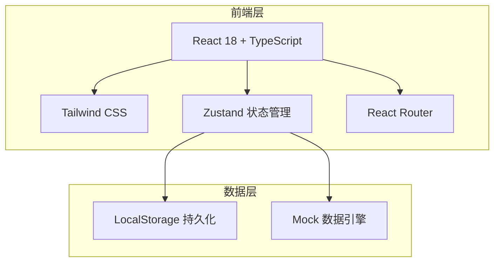
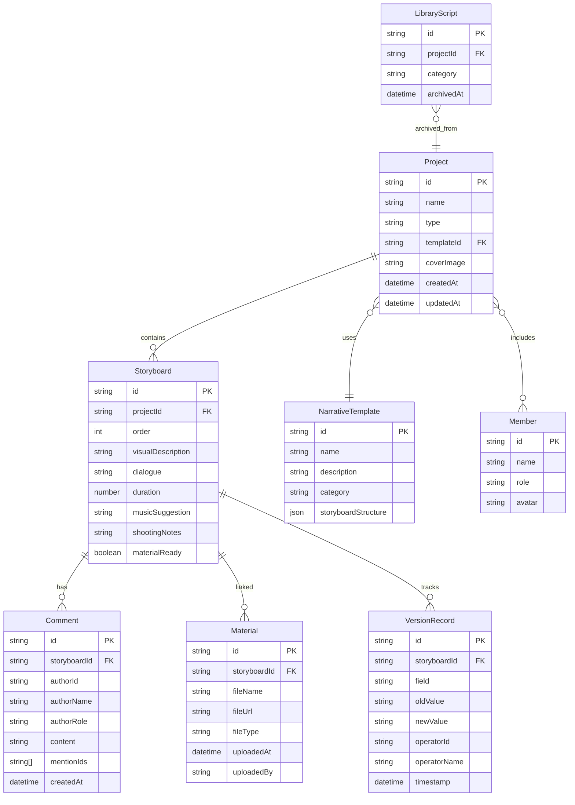

## 1. 架构设计



## 2. 技术说明

- **前端**：React@18 + TailwindCSS@3 + Vite + TypeScript
- **初始化工具**：vite-init
- **后端**：无（纯前端，使用 LocalStorage 持久化 + Mock 数据）
- **数据库**：LocalStorage（结构化 JSON 存储）
- **状态管理**：Zustand（含 persist 中间件）
- **路由**：react-router-dom@6
- **图标库**：lucide-react

## 3. 路由定义

| 路由 | 用途 |
|------|------|
| `/` | 项目仪表盘（项目列表、收藏库、模板） |
| `/project/:id` | 脚本编辑器（分镜编辑、协作、版本历史） |
| `/project/:id/export` | 拍摄提示卡预览与导出 |
| `/project/:id/materials` | 素材管理看板 |
| `/library` | 脚本收藏库 |

## 4. API定义

无后端API，所有数据通过 Zustand store + LocalStorage 管理。数据操作通过 store actions 实现。

## 5. 服务端架构图

不适用（纯前端项目）

## 6. 数据模型

### 6.1 数据模型定义



### 6.2 数据定义语言

使用 TypeScript 类型定义替代 SQL DDL：

```typescript
interface Project {
  id: string;
  name: string;
  type: string;
  templateId?: string;
  coverImage: string;
  createdAt: string;
  updatedAt: string;
}

interface Storyboard {
  id: string;
  projectId: string;
  order: number;
  visualDescription: string;
  dialogue: string;
  duration: number;
  musicSuggestion: string;
  shootingNotes: string;
  materialReady: boolean;
}

interface Comment {
  id: string;
  storyboardId: string;
  authorId: string;
  authorName: string;
  authorRole: 'director' | 'writer' | 'camera' | 'editor';
  content: string;
  mentionIds: string[];
  createdAt: string;
}

interface Material {
  id: string;
  storyboardId: string;
  fileName: string;
  fileUrl: string;
  fileType: 'video' | 'image' | 'audio';
  uploadedAt: string;
  uploadedBy: string;
}

interface VersionRecord {
  id: string;
  storyboardId: string;
  field: string;
  oldValue: string;
  newValue: string;
  operatorId: string;
  operatorName: string;
  timestamp: string;
}

interface Member {
  id: string;
  name: string;
  role: 'director' | 'writer' | 'camera' | 'editor';
  avatar: string;
}

interface NarrativeTemplate {
  id: string;
  name: string;
  description: string;
  category: string;
  storyboardStructure: Partial<Storyboard>[];
}

interface LibraryScript {
  id: string;
  projectId: string;
  category: string;
  archivedAt: string;
}
```
